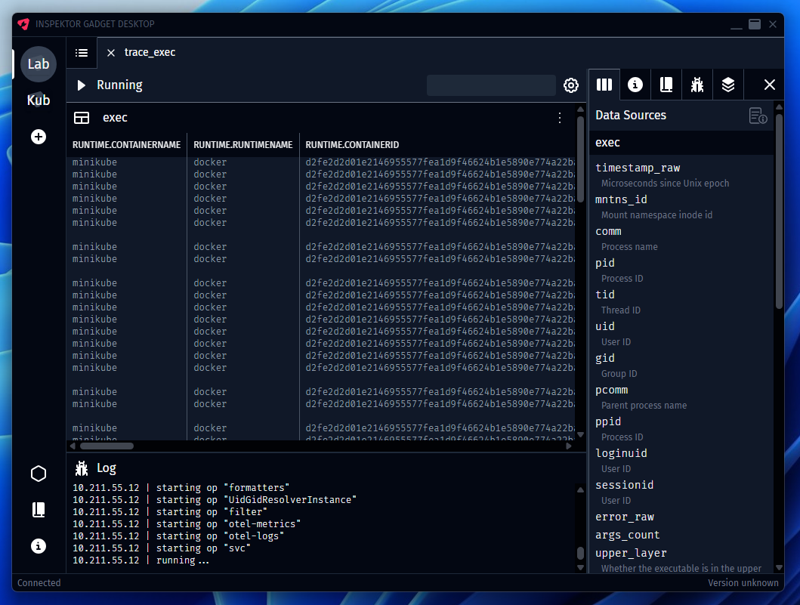

# Inspektor Gadget Desktop



## About

[Inspektor Gadget](https://inspektor-gadget.io) Desktop App based on [wails](https://wails.io) and
[Svelte](https://svelte.dev). Available for Windows, Mac and Linux.

## Status

This project is in its really early stages. Expect rough edges and bugs, but please let us know about them.

## Browser server

Build the standalone server with `make igd`. The resulting `bin/igd` embeds the
frontend and listens on `:8080` by default.

For a hosted single-environment deployment, run `make igd-single-env` and start
the binary with a configuration file:

```console
bin/igd-single-env --config config.json
```

```json
{
  "environment": {
    "id": "3847213b-5fe7-4b2f-998c-c27425067e39",
    "name": "Kubernetes",
    "runtime": "grpc-k8s",
    "params": {}
  }
}
```

Inside Kubernetes, an empty `params` object uses the pod's service account
credentials. The service account needs permission to list gadget pods and use
the pods port-forward subresource.
